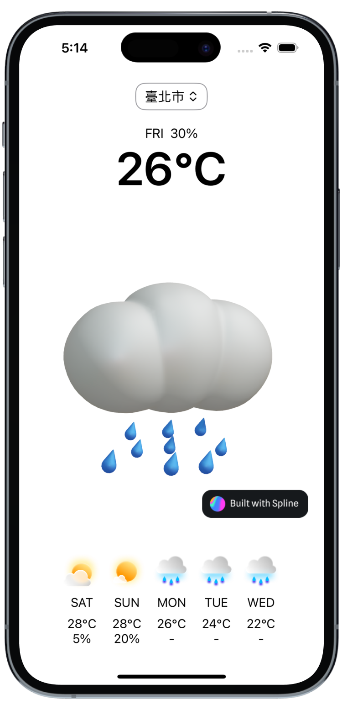

# Weather App



## About

A simple weather application that connects API from Open Weather Data platform in Taiwan.

## Usage

Before running the application, create an `env.xcconfig` file in the root directory.

```env
AUTHORIZATION_TOKEN=********
```
